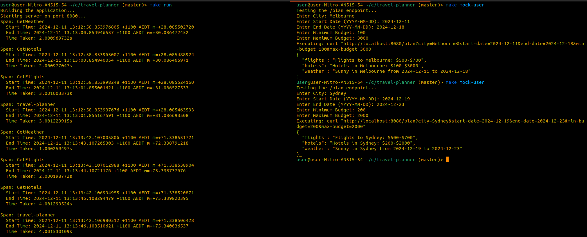
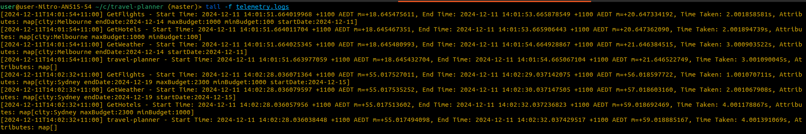

# Travel Planner Application

This project is a simple travel planning application that integrates weather, flight, and hotel information using APIs. It also demonstrates how to use OpenTelemetry for tracing and observability. The application handles user input via a cli interface, allowing users to plan their trips with options for city, start date, end date, and budget.

## Key Features

- **Weather Information**: Fetches weather data for a specified city and date range.
- **Flight Options**: Retrieves available flights within a specified budget.
- **Hotel Options**: Provides hotel options within the specified budget.
- **Tracing with OpenTelemetry**: Uses OpenTelemetry to trace and log API calls for better observability.
- **Makefile for Automation**: A Makefile that automates build, run, testing, and cleaning tasks.

## Why OpenTelemetry?

OpenTelemetry is a powerful tool for observability, and using it for tracing has several benefits over traditional tests and benchmarks:

1. **Distributed Tracing**: OpenTelemetry allows you to trace the flow of requests through different services. In a microservice architecture, this helps you understand how data is passed between different components and identify bottlenecks or failures.

2. **Real-Time Observability**: Unlike static benchmarks that only measure performance under controlled conditions, OpenTelemetry provides real-time monitoring and diagnostics. This means you can track performance metrics and failures in live environments.

3. **Trace Context Propagation**: OpenTelemetry can automatically propagate trace context across service boundaries, ensuring that you can trace the entire request lifecycle even if it spans multiple services.

4. **Detailed Insights**: Tracing provides detailed insights, including start and end times, durations, error rates, and resource usage. This is much richer than traditional benchmarking, which typically focuses on limited performance metrics.

By using OpenTelemetry in this application, we can trace requests across the entire travel planner, from weather data fetching to flight and hotel data, providing a clear picture of system performance and any potential issues.

## How It Works

In this application, OpenTelemetry is used to collect traces and performance metrics that help us observe and analyze the flow of requests and operations. Here's how OpenTelemetry is integrated and works in the context of the travel planner:

### 1. **Setting Up Tracing**

- When the application starts, OpenTelemetry is initialized, and a trace provider is created. This trace provider is responsible for collecting trace data for every request.
- The `tracing.go` file in the `internal/tracing` package is where the OpenTelemetry setup occurs. It configures a `Tracer` that is used to record trace spans (units of work) and propagate trace context across different service boundaries.

### 2. **Creating Spans**

- For every incoming request to the `/plan` endpoint, a new span is created. A span represents a single operation (e.g., calling the weather API or fetching flight data).
- For each operation within the request (e.g., calling an external API to fetch weather, flights, or hotel data), a new span is created. These spans are children of the main request span and provide detailed trace data.
- Each span contains metadata such as:
- **Start time** and **end time** (duration)
- **Attributes** such as the request parameters (e.g., city, start date, end date, etc.)
- **Error status** in case any operation fails (e.g., weather API not responding)

### 3. **Propagating Trace Context**

- When the application makes HTTP requests to external APIs (e.g., to fetch weather, flights, or hotel data), it includes the trace context in the request headers.
- This ensures that the trace context is passed across service boundaries, enabling full trace propagation for distributed systems.

### 4. **Logging Traces and Spans**

- All trace data is captured in spans and sent to a trace exporter (in this case, printed to `telemetry.logs` via `stdout`).
- The traces are logged as plain text, showing detailed information about each span, including:
- The **name** of the span (e.g., `fetch_weather`, `fetch_flights`, etc.)
- The **start time** and **duration** of the span.
- The **attributes** associated with the span (such as city, start date, end date, etc.).
- The **status** of the span (whether the operation was successful or encountered an error).

### 5. **Viewing the Logs**

- You can view the generated traces and spans in the `telemetry.logs` file. This file contains detailed trace information for each request, showing the sequence of operations that took place during the request's lifecycle.

### 6. **Why It Matters**

- By looking at the traces and spans in `telemetry.logs`, you can analyze:
- **Which parts of the system are taking too long** (e.g., if fetching flights is slow).
- **Where errors or failures are occurring** (e.g., if a particular external API call fails).
- **The overall performance of the system**, allowing you to optimize and fix bottlenecks.

In this example, the main trace for the `/plan` request contains child spans for each external API call (`fetch_weather`, `fetch_flights`, `fetch_hotels`). Each child span has detailed attributes (e.g., city, dates, budget) and a duration. These logs provide full visibility into the operations and their performance.

OpenTelemetry tracing is a powerful tool to provide real-time insights into your application's behavior, especially in production environments where traditional tests and benchmarks would not provide this level of detail.

## Prerequisites

- Go 1.18+ installed
- `make` installed (typically pre-installed on most Unix-like systems)

## Setup Instructions

1. **Clone the repository**:

   ```bash
   git clone https://github.com/yourusername/travel-planner.git
   cd travel-planner
   ```

2. **Install dependencies**:

   Run the following command to ensure that all Go dependencies are installed:

   ```bash
   make make-deps
   ```

   This will fetch and clean up all required dependencies using `go mod tidy`.

3. **Build the application**:

   To compile the application:

   ```bash
   make build
   ```

4. **Run the application**:

   To start the application server on the default port (8080):

   ```bash
   make run
   ```

   The application will be available at `http://localhost:8080`.

5. **Test the `/plan` endpoint**:

   To test the `/plan` endpoint and simulate user input:

   ```bash
   make mock-user
   ```

   This will prompt you for the required parameters (City, Start Date, End Date, Minimum Budget, and Maximum Budget) and then send a request to the application. Concise info from will be generated on the commandline and more detailed information will be logged in telemetry.logs

6. **Clean up build artifacts**:

   To remove compiled files and cleanup:

   ```bash
   make clean
   ```

## File Overview

- **Makefile**: Contains build, run, and test targets for managing the application lifecycle.
- **cmd/root.go**: Defines the main HTTP handler for the `/plan` endpoint.
- **configs/config.yaml**: Stores API keys for weather, flights, and hotels.
- **internal**: Contains the core logic for fetching weather, flights, and hotel data.
  - **flights/flights.go**: Handles fetching flight data.
  - **hotels/hotels.go**: Handles fetching hotel data.
  - **weather/weather.go**: Handles fetching weather data.
  - **tracing/tracing.go**: Sets up OpenTelemetry tracing and logs.

## Troubleshooting

- **Missing Dependencies**: Run `make make-deps` to ensure that all dependencies are fetched and updated.
- **Invalid Parameters**: If the `/plan` endpoint fails due to invalid parameters (e.g., missing city, incorrect date format), ensure the query string is correct and matches the expected format.

## Example Screenshot



### Telemetry logs(simplified)



### System Requirements

This project is designed to run on Unix-based machines, including:

- **macOS** (version 10.15 or higher)
- **Linux** (Ubuntu, Fedora, or any other Linux distribution)

For **Windows** users, it is recommended to use **Windows Subsystem for Linux (WSL)** or run the commands in a **Linux-based environment** like Docker or a virtual machine.
